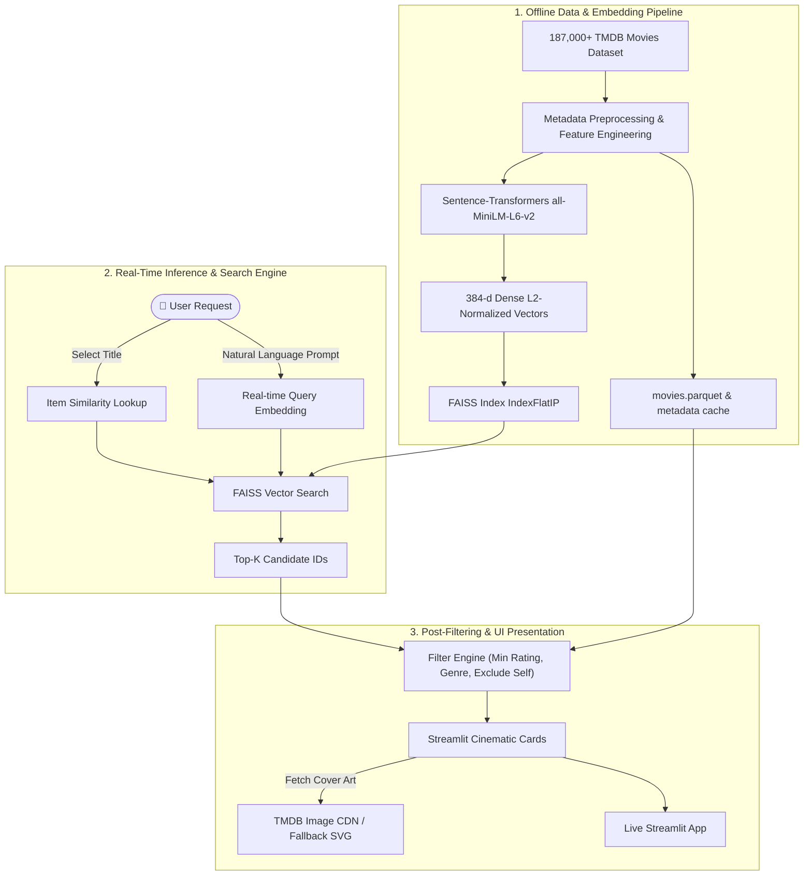

<div align="center">

# 🎬 CineMatch AI — Intelligent Movie Recommender

[](https://movies-recommendation-system-2.streamlit.app/)
[](https://www.python.org/)
[](https://github.com/facebookresearch/faiss)
[](https://huggingface.co/sentence-transformers/all-MiniLM-L6-v2)
[](https://github.com/astral-sh/uv)
[](https://opensource.org/licenses/MIT)

**A lightning-fast, production-ready Movie Recommendation System indexing 187,000+ films using FAISS vector indexing, dense Sentence-Transformers (MiniLM) embeddings, and a cinematic dark-mode Streamlit interface.**

[🌐 Explore Live App](https://movies-recommendation-system-2.streamlit.app/) • [🚀 Quickstart](#-getting-started) • [🧠 Architecture](#-system-architecture) • [✨ Features](#-key-features)

---

</div>

## 🌐 Live Web Application

The application is deployed and hosted live on **Streamlit Cloud**:

👉 **[https://movies-recommendation-system-2.streamlit.app/](https://movies-recommendation-system-2.streamlit.app/)**

> Try out **"Plot & Vibe Search"** by describing any storyline or mood in natural language, or use **"More Like This"** to instantly explore nearest-neighbor recommendations for your favorite films!

---

## 🌟 Key Features

- **🎯 Dual Recommendation Modes**:
  - **1. Item-to-Item Similarity ("More Like This")**: Pick or search any title across the 187,000+ film catalog (or click quick picks like *Interstellar*, *Inception*, or *The Dark Knight*) to find the closest cosine-similarity neighbors in 384-dimensional embedding space.
  - **2. Natural Language Semantic Search ("Plot & Vibe Search")**: Type free-form themes, plot concepts, or moods (e.g., *"a lonely astronaut surviving on Mars"* or *"dark cyberpunk neo-noir detective in rainy metropolis"*). Queries are embedded in real time via `all-MiniLM-L6-v2` and searched against FAISS in milliseconds.
- **⚡ Engineered for Low Memory & Ultra-Low Latency**:
  - **Sub-Millisecond Vector Retrieval**: Powered by Meta's **FAISS** (`IndexFlatIP` on $L_2$-normalized vectors).
  - **Memory-Mapped Embeddings**: Precomputed embeddings (`.npy`) loaded with `mmap_mode="r"` to keep RAM footprints well within free cloud tier limitations.
  - **High-Performance Parquet Storage**: Fast columnar reads via **PyArrow** and **Pandas** for metadata lookups across 187k+ rows.
- **🎛️ Dynamic Multi-Factor Filtering**:
  - Customize recommendation counts ($4$ to $20$ cards).
  - Minimum rating filter (⭐ $0.0$ to $9.0+$).
  - Multi-select genre filtering (Sci-Fi, Thriller, Action, Drama, Animation, and more).
- **🖼️ Rich Cinematic UI**:
  - Real-time TMDB CDN posters (`https://image.tmdb.org/t/p/w500`).
  - Graceful fallback SVG posters when covers are unavailable.
  - Interactive synopsis expanders and direct TMDB movie profile links.
  - Custom dark glassmorphic styling tailored for a sleek cinematic feel.

---

## 🧠 System Architecture



---

## 🛠️ Tech Stack

| Layer | Technologies |
|---|---|
| **Frontend UI** | [Streamlit](https://streamlit.io/) (Custom CSS Dark Theme, Responsive Cards) |
| **Vector Search Engine** | [FAISS](https://github.com/facebookresearch/faiss) (`faiss-cpu`, Inner Product Index) |
| **Embedding Model** | [Sentence-Transformers](https://www.sbert.net/) (`all-MiniLM-L6-v2`, 384 dimensions) |
| **Data Processing** | [Pandas](https://pandas.pydata.org/), [NumPy](https://numpy.org/), [PyArrow](https://arrow.apache.org/docs/python/) (Parquet) |
| **Package & Dependency Manager** | [uv](https://github.com/astral-sh/uv) / pip |
| **Runtime & Hosting** | Python `>=3.12` • [Streamlit Cloud](https://streamlit.io/cloud) |

---

## 📁 Project Structure

```text
movies-recommendation-system-2/
├── app.py                          # Streamlit application logic and UI interface
├── pyproject.toml                  # Project configuration and dependency specifications
├── uv.lock                         # Deterministic lockfile for uv package manager
├── requirements.txt                # Pip requirements for cloud deployment
├── README.md                       # Project documentation
├── movie_recommender_files/        # Precomputed data artifacts
│   ├── movies.parquet              # Compressed columnar metadata (187,501 films)
│   ├── movies.faiss                # Serialized FAISS vector index
│   ├── movie_embeddings.npy        # 384-dimensional dense embeddings
│   └── movies_meta.pkl             # Bidirectional lookup dictionaries
└── .streamlit/
    └── config.toml                 # Streamlit theme and server configurations
```

---

## 🚀 Getting Started

### 1. Prerequisites
Ensure you have **Python 3.12+** installed on your machine.

### 2. Clone the Repository
```bash
git clone https://github.com/MokshShah25/movies-recommendation-system-2.git
cd movies-recommendation-system-2
```

### 3. Setup Virtual Environment & Dependencies

#### Option A: Using `uv` (Recommended — Fastest)
```bash
# Install uv if you haven't already:
# Windows (PowerShell):
powershell -ExecutionPolicy ByPass -c "irm https://astral.sh/uv/install.ps1 | iex"
# macOS/Linux:
curl -LsSf https://astral.sh/uv/install.sh | sh

# Sync dependencies:
uv sync
```

#### Option B: Using Standard `pip` & `venv`
```bash
python -m venv .venv

# Windows:
.venv\Scripts\activate
# macOS / Linux:
source .venv/bin/activate

pip install -r requirements.txt
```

### 4. Run the Streamlit App Locally
```bash
# If using uv:
uv run streamlit run app.py

# If using standard venv:
streamlit run app.py
```

Open your browser and navigate to:
👉 **[http://localhost:8501](http://localhost:8501)**

---

## 💡 Usage Examples

### 1. "More Like This"
1. Choose from pre-configured **Quick Picks** (*Interstellar, Inception, The Dark Knight, Fight Club, Spirited Away, Pulp Fiction*) or type any title into the movie selector.
2. The **Hero Spotlight** will feature the selected movie's rating, genres, release year, and overview.
3. Review recommended titles, match percentages, genre chips, and expanders for synopses.

### 2. "Plot & Vibe Search"
1. Switch to the **🔮 Plot & Vibe Search** tab.
2. Click one of the inspiration buttons or type your own storyline:
   - *"A solitary astronaut stranded on Mars trying to survive"*
   - *"A gritty cyberpunk detective hunting rogue androids in a rainy city"*
   - *"Time travel paradox where characters receive letters from the future"*
3. Click **🚀 Search Semantic Vectors** to retrieve semantically aligned recommendations.

---

## ⚙️ Configuration & Secrets (Optional)

The application works out of the box with zero required API keys. Posters are served directly via TMDB's public image CDN.

If you wish to extend the application with live TMDB API endpoints (such as fetching video trailers):
1. Create a file at `.streamlit/secrets.toml`:
   ```toml
   TMDB_API_KEY = "your_tmdb_api_key"
   ```
2. Streamlit will automatically load secrets securely.

---

## 👤 Author & Acknowledgments

- **Moksh Shah**
  - GitHub: [@MokshShah25](https://github.com/MokshShah25)
  - Live Demo: [movies-recommendation-system-2.streamlit.app](https://movies-recommendation-system-2.streamlit.app/)

Special thanks to **The Movie Database (TMDB)** for metadata and poster assets, and the **Hugging Face** & **Meta AI Research** communities for `sentence-transformers` and `faiss`.

---

<div align="center">
  <sub>Built with ❤️ using Python, FAISS, Sentence Transformers, and Streamlit.</sub>
</div>
